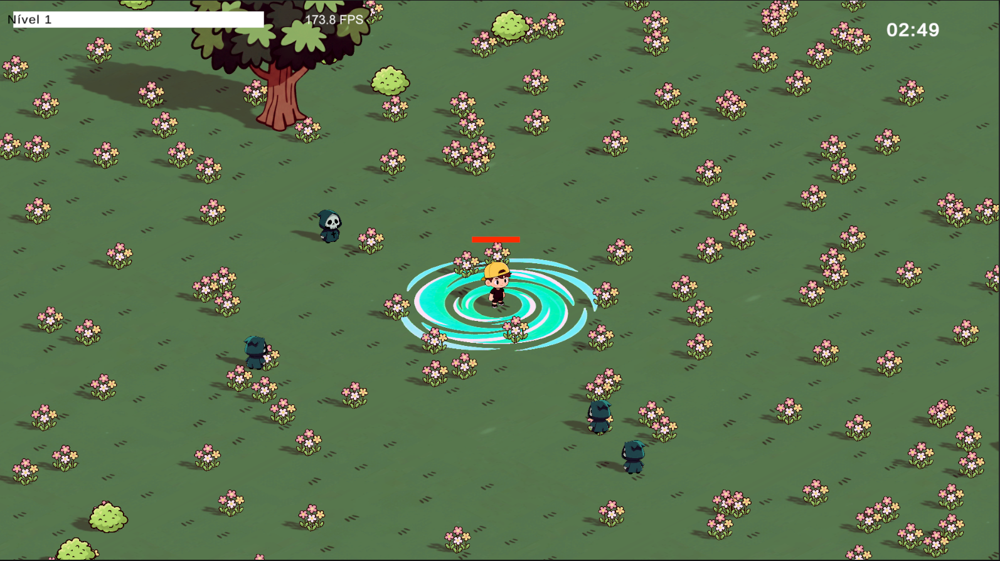
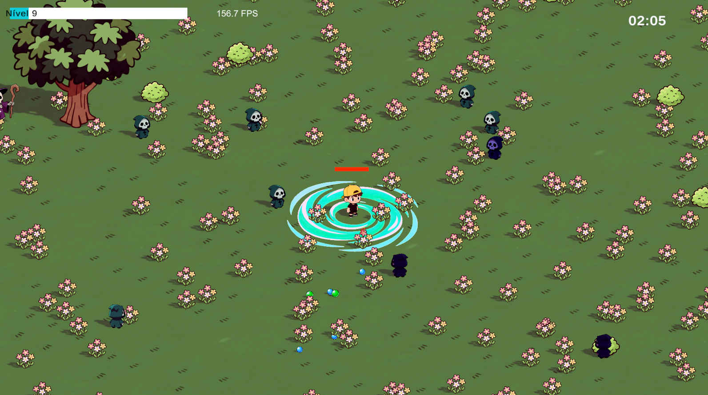
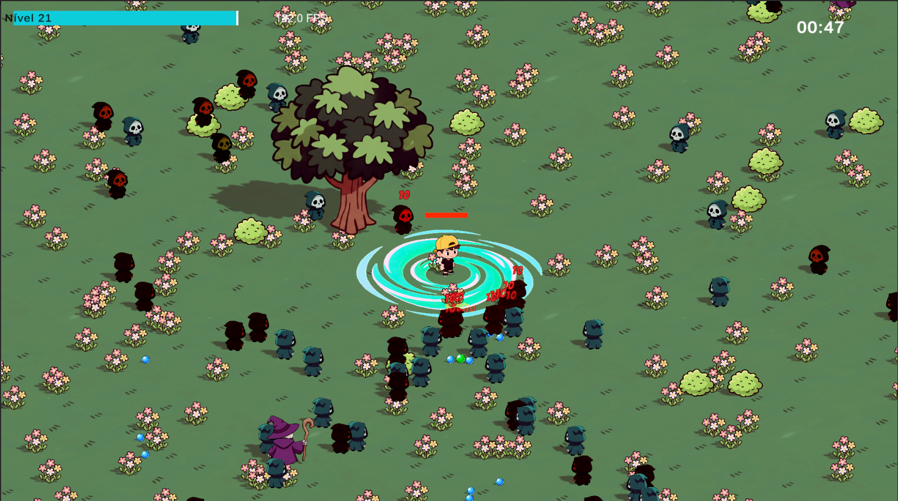

# Sistemas de IA

## Índice
1. [Visão Geral](#visão-geral)
2. [Pathfinding (A*)](#pathfinding-a)
3. [State Machine (FSM)](#state-machine-fsm)
4. [Algoritmo Genético](#algoritmo-genético)
5. [Integração e Impacto](#integração-e-impacto)

---

## Visão Geral

Este readme descreve a implementação de três sistemas de IA no jogo Goofy Survivors:

| Sistema | Propósito | Localização |
|---------|----------|------------|
| Pathfinding (A*) | Navegação inteligente de inimigos | `__Scripts/Pathfinding/` |
| State Machine | Controlo comportamental | `__Scripts/Enemy/StateMachine/` |
| Algoritmo Genético | Evolução automática de dificuldade | `__Scripts/Genetic/` |

---

**Grupo**

- **Membro 1:** Gonçalo Veloso - 22348
- **Membro 2:** Martim Moreira - 22354

---

**Resumo do Trabalho (Texto do Trabalho Prático)**

Este repositório implementa três sistemas de IA integrados no jogo Goofy Survivors: um sistema de
pathfinding baseado em A* para navegação em grids, uma máquina de estados (FSM) para controlo comportamental
dos inimigos e um algoritmo genético para evolução automática da dificuldade entre ondas. 

**Pontos principais implementados**
- Pathfinding A*: grid discretizado, `FindPath()` retorna lista de Vector3, heurística e custos g/h/f.
- FSM: estados modulares (`IEnemyState`), cache de estados, transições explícitas (Idle, Chasing, Attacking, etc.).
- Algoritmo Genético: `EnemyGenes` (HP, Dano, Velocidade), função de fitness, elitismo (top 20%), seleção do top 50%,
  crossover uniforme e mutação bidirecional com injeção de diversidade.

---

## Pathfinding (A*)

### Descrição

O algoritmo A* calcula o caminho mais curto entre dois pontos em um mapa discretizado em grid, permitindo que os inimigos contornem obstáculos de forma inteligente.

### Implementação

O algoritmo mantém dois conjuntos (Open Set e Closed Set) e calcula para cada nó:
- **gCost**: Custo real do caminho desde a origem
- **hCost**: Heurística (distância em linha reta) até ao alvo
- **fCost**: gCost + hCost

A iteração continua até encontrar o alvo ou esgotar possibilidades:

```csharp
while (openSet.Count > 0)
{
    Node currentNode = FindNodeWithLowestFCost(openSet);
    
    if (currentNode == targetNode)
        return RetracePath(startNode, targetNode);

    openSet.Remove(currentNode);
    closedSet.Add(currentNode);

    foreach (Node neighbor in GetNeighbors(currentNode))
    {
        if (!neighbor.walkable || closedSet.Contains(neighbor))
            continue;

        float newCost = currentNode.gCost + GetDistance(currentNode, neighbor);
        if (newCost < neighbor.gCost || !openSet.Contains(neighbor))
        {
            neighbor.gCost = newCost;
            neighbor.hCost = GetDistance(neighbor, targetNode);
            neighbor.parent = currentNode;
            
            if (!openSet.Contains(neighbor))
                openSet.Add(neighbor);
        }
    }
}
```

### Heurística Utilizada

A implementação usa **heurística Diagonal (Octile)**, adequada para grids com movimento em 8 direções:

```csharp
// Custo 10 para movimentos cardinais, 14 para diagonais (≈10√2)
if (dstX > dstZ)
    return 14 * dstZ + 10 * (dstX - dstZ);
return 14 * dstX + 10 * (dstZ - dstX);
```

Esta heurística é **admissível** (nunca sobrestima) e **consistente**, garantindo optimalidade do caminho.

### Justificação

A* foi escolhido por:
- Garantir encontrar o caminho mais curto
- Complexidade computacional previsível O(n log n)
- Funcionar eficientemente com grids
- Permitir inimigos competentes sem ser impossível de ultrapassar

---

## State Machine (FSM)

### Descrição

A máquina de estados implementa um sistema de controlo comportamental onde cada inimigo ocupa um único estado e transiciona baseado em condições (distância ao jogador, saúde, etc).

### Arquitetura

Cada estado implementa uma interface comum:

```csharp
public interface IEnemyState
{
    EnemyStateType StateType { get; }
    void Enter(EnemyStateMachine machine);
    void Tick(EnemyStateMachine machine);
    void FixedTick(EnemyStateMachine machine);
    EnemyStateType CheckTransitions(EnemyStateMachine machine);
}
```

O loop principal da máquina:

```csharp
private void Update()
{
    currentState?.Tick(this);
    EnemyStateType nextStateType = currentState?.CheckTransitions(this) ?? EnemyStateType.None;
    
    if (nextStateType != CurrentStateType)
        TransitionTo(nextStateType);
}
```

### Estados Implementados

| Estado | Condição | Ação | Transição |
|--------|----------|------|-----------|
| Idle | Spawn sem alvo | Aguarda | → Chasing |
| Chasing | Alvo à distância | Segue pathfinding | → Attacking/Stunned |
| Attacking | Alvo em range | Ataca | → Chasing/Fleeing |
| KnockedBack | Sofre knockback | Retrocede | → Chasing |
| Stunned | Atordoado | Imobilizado | → Chasing |
| Fleeing | Health (HP) < 20% | Foge | → Attacking/Dying |
| Dying | HP = 0 | Animação | → Dead |

Exemplo de implementação de estado (Chasing):

```csharp
public class ChasingState : IEnemyState
{
    public void Enter(EnemyStateMachine ctx)
    {
        if (ctx.Movement != null && ctx.CurrentTarget != null)
            ctx.Movement.SetTarget(ctx.CurrentTarget);
    }

    public EnemyStateType? CheckTransitions(EnemyStateMachine ctx)
    {
        if (ctx.Stats.CurrentHealth <= 0) return EnemyStateType.Dying;
        if (ctx.IsTargetInRange() && ctx.CanAttack()) return EnemyStateType.Attacking;
        return null;
    }
}
```

### Justificação

A State Machine:
- Separa comportamentos em entidades independentes e testáveis
- Define transições explícitas com prioridades claras
- Evita comportamentos conflitantes
- Permite cache de estados

---

## Algoritmo Genético

### Descrição

O algoritmo genético: avalia fitness, seleciona genes superiores, combina (crossover) e altera (mutação), criando progressão automática de dificuldade.

### Cromossoma

```csharp
public struct EnemyGenes
{
    public float HealthMultiplier;
    public float DamageMultiplier;
    public float SpeedMultiplier;
}
```

### Aplicação de Genes

Os genes são aplicados aos inimigos no spawn via `EnemyStats.ApplyGenes()`:

```csharp
public void ApplyGenes(EnemyGenes genes)
{
    MaxHealth *= genes.HealthMultiplier;
    CurrentHealth = MaxHealth;
    baseDamage *= genes.DamageMultiplier;
    moveSpeed *= genes.SpeedMultiplier;
    
    // Atualiza cor visual baseada nos genes
    UpdateGeneVisuals();
}
```


### Função de Fitness

A avaliação de fitness de cada inimigo segue a fórmula:

$$
    ext{Fitness} = (2.0 \times \text{Dano}) + (0.5 \times \text{Tempo}) + (0.3 \times \text{Eficiência}) + \text{BónusVelocidade}
$$

Onde:
- $\text{Eficiência} = \frac{\text{Dano}}{\text{MultiplicadorHP}}$
- $\text{BónusVelocidade} = \text{SpeedMultiplier} \times 0.5$ **(apenas se $\text{SpeedMultiplier} > 1$ e $\text{Dano} > 0$)**

Assim, apenas inimigos rápidos que causaram dano recebem bónus de velocidade.


### Seleção e Reprodução

**Uniform Crossover**: Cada gene (vida, dano, velocidade) tem 50% de probabilidade de vir de cada pai.

**Mutação Bidirecional**:

```csharp
private const float MUTATION_RATE = 0.2f;
private const float MUTATION_STRENGTH = 0.15f;

if (Random.value < MUTATION_RATE)
{
    float mutation = Random.Range(-MUTATION_STRENGTH, MUTATION_STRENGTH);
    gene += mutation;
    gene = Mathf.Clamp(gene, 0.5f, 3.0f);
}
```

A mutação pode aumentar ou diminuir genes, permitindo realocação de recursos.

### Resultados Observados

Durante os testes do jogo, observámos os seguintes padrões de evolução:

| Ondas | Comportamento Típico |
|-------|---------------------|
| 1-3 | Genes próximos do default (1.0x), variação inicial |
| 4-6 | Especialização emerge: alguns inimigos focam em velocidade (~1.5x), outros em HP (~1.4x) |
| 7+ | Genes dominantes estabilizam com multiplicadores entre 1.5x-2.0x nos traços mais eficazes |

A pressão seletiva favorece inimigos que causam dano antes de morrer, resultando numa população naturalmente mais agressiva e resistente ao longo do tempo.


### Evolução Visual por Ondas

As capturas abaixo demonstram a evolução genética ao longo das primeiras ondas:

| Wave 1 (Genes Base) | Wave 2 (Primeira Evolução) | Wave 3 (Especialização) |
|---------------------|---------------------------|-------------------------|
|  |  |  |
| Inimigos brancos (1.0x) | Primeiros tons avermelhados | Vermelhos dominantes |


### Elitismo e Diversidade

O algoritmo preserva:
- **Elitismo**: Top 20% dos melhores genes passa à geração seguinte sem mutação
- **Diversidade**: Em cada geração, são injetados genes aleatórios (`CreateRandomGenes(0.8f, 1.5f)`) e sempre o gene base (`EnemyGenes.Default`)

```csharp
nextGen.Add(CreateRandomGenes(0.8f, 1.5f));
nextGen.Add(EnemyGenes.Default);
```

### Integração com Pathfinding

O pathfinding é integrado na FSM via `EnemyPathfinding`, que calcula caminhos periodicamente:

```csharp
private void UpdatePath()
{
    if (Pathfinding.Instance != null && player != null)
    {
        var newPath = Pathfinding.Instance.FindPath(transform.position, player.position);
        if (newPath != null && newPath.Count > 0)
        {
            path = newPath;
            currentWaypointIndex = 0;
        }
    }
}
```

### Avaliação de Fitness

Quando um inimigo morre, o fitness é reportado ao `EnemySpawner`:

```csharp
public void Die()
{
    TimeAlive = Time.time - startTime;
    if (EnemySpawner.Instance != null)
    {
        EnemySpawner.Instance.ReportEnemyFitness(CurrentGenes, DamageDealt, TimeAlive);
    }
}
```

## Estrutura de Código importante

- Pathfinding: `__Scripts/Pathfinding/` (`Pathfinding.cs`, `Grid.cs`, `Node.cs`)
- State Machine: `__Scripts/Enemy/StateMachine/` (máquina e estados em `States/`)
- Genética: `__Scripts/Genetic/` (definição `EnemyGenes.cs`) e `__Scripts/Enemy/EnemySpawner.cs` (evolução)
- Integração com inimigos: `__Scripts/Enemy/EnemyStats.cs`, `EnemyPathfinding.cs`, `EnemyMovement.cs`

---

## Integração e Impacto

### Fluxo de Sistemas

```
Pathfinding (A*) → State Machine → Inimigo Morre
                                           ↓
                                Avalia Fitness
                                           ↓
                    Algoritmo Genético Evolui Genes
                                           ↓
                        Próxima Onda + Genes Novos
```

### Comparação Antes e Depois

| Aspecto | Sem IA | Com IA |
|---------|--------|--------|
| Navegação | Linear através de obstáculos | Contorna inteligentemente |
| Comportamento | Estático | Contextual (perseguição, ataque, fuga) |
| Dificuldade | Constante | Progressiva e adaptativa |
| Variedade | Inimigos idênticos | Especializações emergem |

### Evolução Visual dos Inimigos

O sistema de cores mapeia os genes evoluídos para feedback visual imediato:

| Cor | Significado | Causa |
|-----|-------------|-------|
| **Branco** | Genes base (1.0x) | Sem evolução significativa |
| **Vermelho** | Alto Damage | Fitness favorece dano causado |
| **Verde** | Alto Health (HP) | Sobrevivência prolongada |
| **Azul** | Alta Velocidade | Bónus de velocidade no fitness |
| **Tons mistos** | Genes balanceados | Crossover de múltiplos traços |


### Benefícios de Design

- **Separação de Responsabilidades**: Cada sistema é independente
- **Extensibilidade**: Novos estados adicionam-se sem modificar código existente
- **Reutilização**: Pathfinding utilizado por qualquer entidade
- **Performance**: Cache de estados

---

## Conclusão

A implementação de três sistemas de IA em sinergia cria uma experiência progressivamente desafiante e adaptativa. O algoritmo genético é crucial, pois permite que os inimigos evoluam naturalmente, criando a ilusão de uma população inteligente que aprende.

---